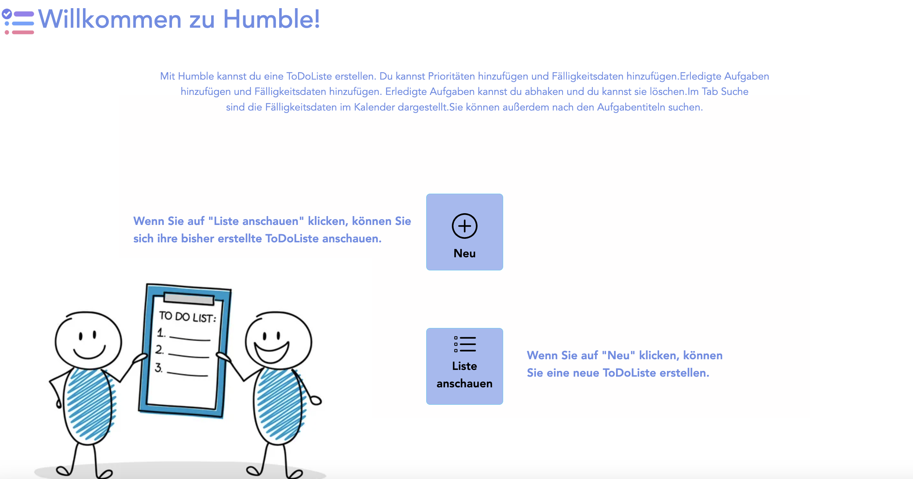
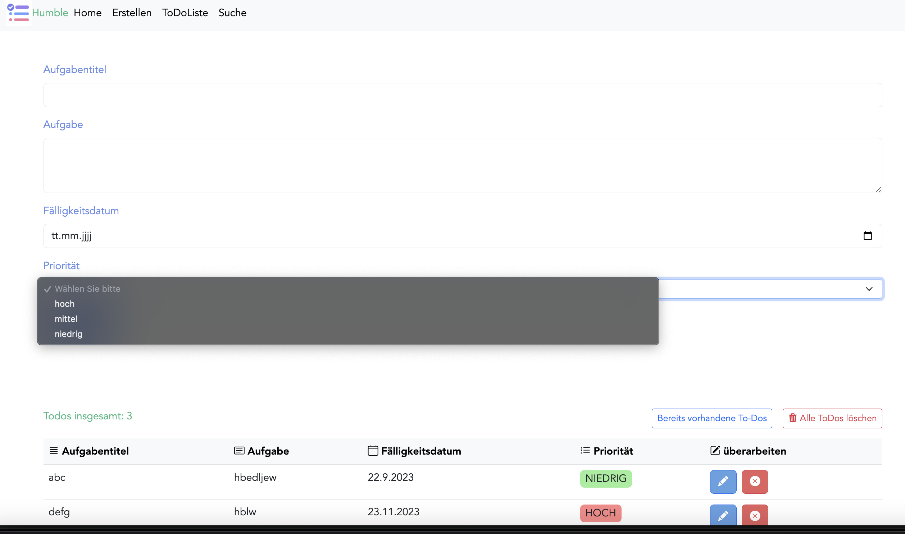
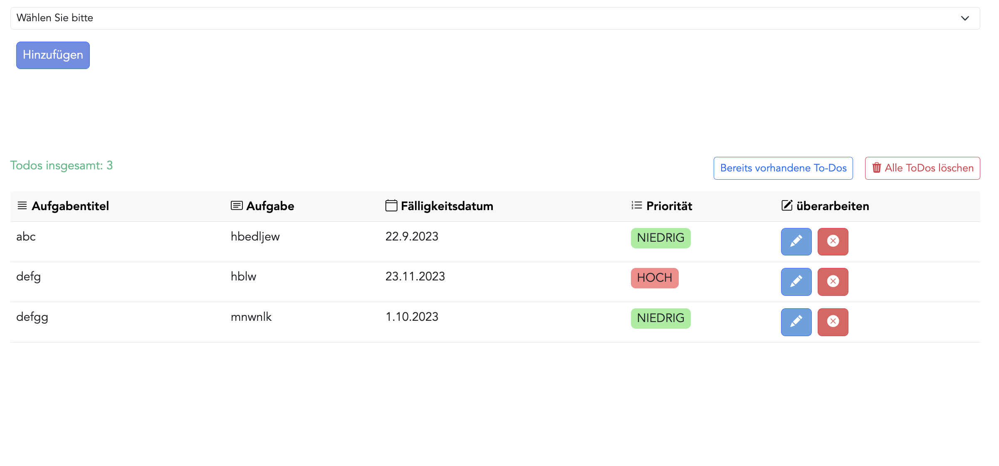
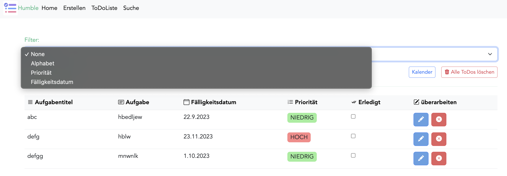
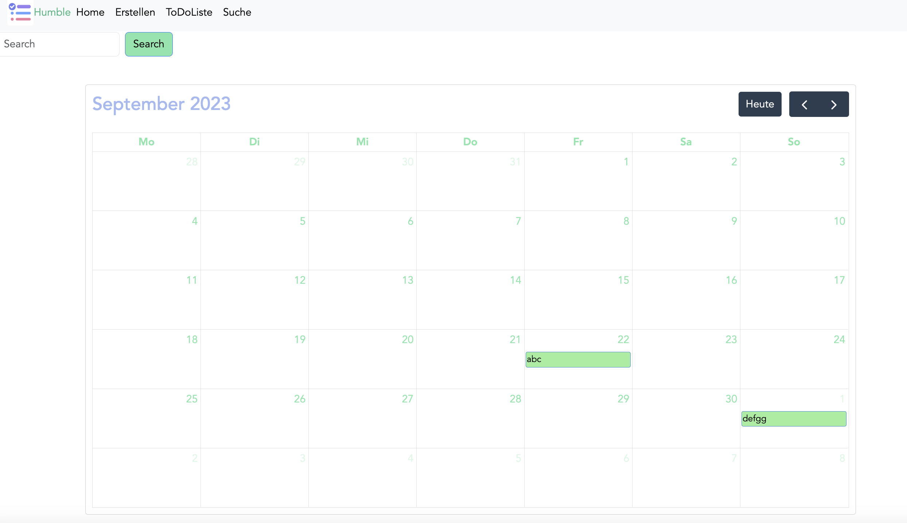

# ToDoListApp

#ToDoListApp Humble

#Benutzer sollte Aufgaben hinzufügen und abhaken können

#Benutzer sollte Aufgabentitel bearbeiten können, falls er etwas überarbeiten will

#Benutzer sollte seine Aufgaben nach Fälligkeit ordnen können

#Benutzer soll ein Kalender mit allen Aufgabentiteln haben und Aufgabentiteln suchen können

